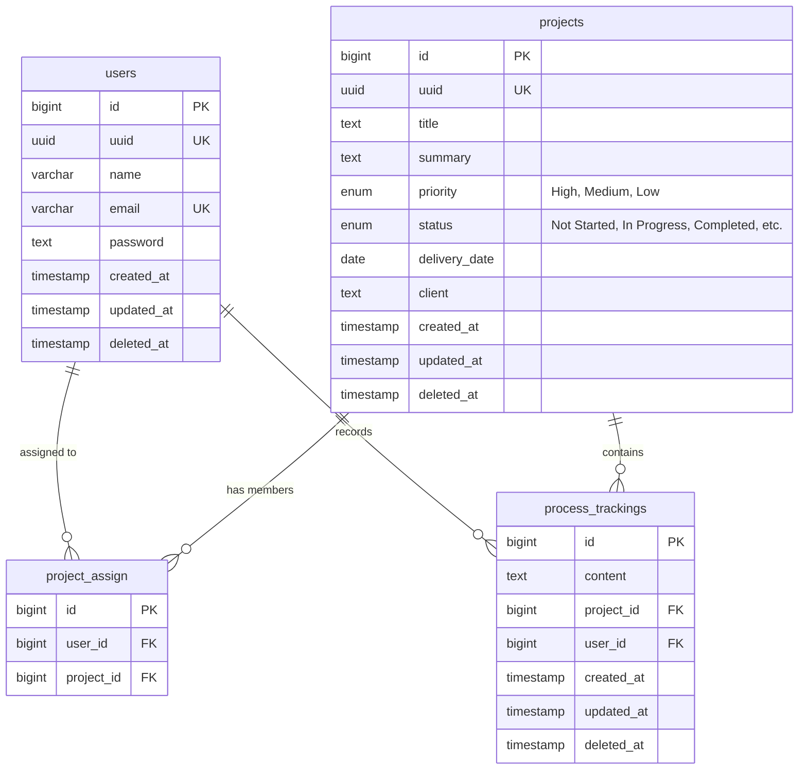

# users
| Column        | Type         | Nullable | Default           | Description                               |
|---------------|--------------|----------|-------------------|-------------------------------------------|
| id            | BIGINT       | No       |                   | Primary key, auto-generated               |
| uuid          | UUID         | No       | gen_random_uuid() |                                           |
| name          | VARCHAR      | No       |                   |                                           |
| email         | VARCHAR(245) | No       |                   | UNIQUE                                    |
| password      | TEXT         | No       |                   |                                           |
| created_at    | TIMESTAMP    | No       | CURRENT_TIMESTAMP | TIMESTAMP WITH TIME ZONE                  |
| updated_at    | TIMESTAMP    | No       | CURRENT_TIMESTAMP | TIMESTAMP WITH TIME ZONE                  |
| deleted_at    | TIMESTAMP    | Yes      |                   | Soft delete marker (null = active record) |

# projects
| Column        | Type      | Nullable | Default           | Description                                                   |
|---------------|-----------|----------|-------------------|---------------------------------------------------------------|
| id            | BIGINT    | No       |                   | Primary key, auto-generated                                   |
| uuid          | UUID      | No       | gen_random_uuid() |                                                               |
| title         | TEXT      | No       |                   |                                                               |
| summary       | TEXT      | No       |                   |                                                               |
| priority      | ENUM      | No       |                   | HIGH/MEDIUM/LOW                                               |
| status        | ENUM      | No       |                   | NOT_STARTED/IN_PROGRESS/REVIEWING/COMPLETED/ON_HOLD/CANCELLED |
| delivery_date | DATE      | No       |                   |                                                               |
| client        | TEXT      | No       |                   |                                                               |
| created_at    | TIMESTAMP | No       | CURRENT_TIMESTAMP | TIMESTAMP WITH TIME ZONE                                      |
| updated_at    | TIMESTAMP | No       | CURRENT_TIMESTAMP | TIMESTAMP WITH TIME ZONE                                      |
| deleted_at    | TIMESTAMP | Yes      |                   | Soft delete marker (null = active record)                     |

# project_assignments
| Column        | Type      | Nullable | Default           | Description                               |
|---------------|-----------|----------|-------------------|-------------------------------------------|
| id            | BIGINT    | No       |                   |                                           |
| user_id       | BIGINT    | No       |                   | Foreign key                               |
| project_id    | BIGINT    | No       |                   | Foreign key                               |
| created_at    | TIMESTAMP | No       | CURRENT_TIMESTAMP | TIMESTAMP WITH TIME ZONE                  |
| updated_at    | TIMESTAMP | No       | CURRENT_TIMESTAMP | TIMESTAMP WITH TIME ZONE                  |
| deleted_at    | TIMESTAMP | Yes      |                   | Soft delete marker (null = active record) |

# process_trackings
| Column     | Type      | Nullable | Default           | Description                               |
|------------|-----------|----------|-------------------|-------------------------------------------|
| id         | BIGINT    | No       |                   | Primary key, auto-generated               |
| content    | TEXT      | No       |                   |                                           |
| project_id | BIGINT    | No       |                   | Foreign key                               |
| user_id    | BIGINT    | No       |                   | Foreign key                               |
| created_at | TIMESTAMP | No       | CURRENT_TIMESTAMP | TIMESTAMP WITH TIME ZONE                  |
| updated_at | TIMESTAMP | No       | CURRENT_TIMESTAMP | TIMESTAMP WITH TIME ZONE                  |
| deleted_at | TIMESTAMP | Yes      |                   | Soft delete marker (null = active record) |

